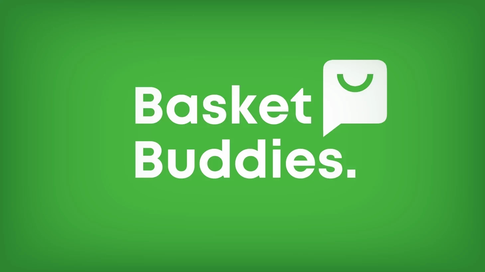

# BasketBuddies

BasketBuddies is an intuitive application designed to simplify grocery shopping for couples, families, communities, and friends. With its user-friendly interface and collaborative features, BasketBuddies makes grocery shopping hassle-free by ensuring seamless coordination between users.

## Features

- **Shared Shopping Lists:** Create and maintain shared shopping lists accessible to all members of your group.
- **Real-Time Collaboration:** Add, remove, or modify items on the shopping list in real-time, keeping everyone informed.
- **Customizable Lists:** Personalize shopping lists with custom categories, notes, and reminders.
- **Cross-Platform Accessibility:** Access your shopping lists from smartphones, tablets, and web browsers.
- **User-Friendly Interface:** Simple and intuitive interface for users of all ages and tech levels.

## Installation

To install BasketBuddies, simply clone this repository to your local machine:

```bash
git clone https://github.com/UgurUgurUgur/BasketBuddies.git
```

## Usage

1. Open the app on your device.
2. Sign in or create an account.
3. Create a new shopping list or join an existing one.
4. Add or remove items as needed.
5. Collaborate with your shopping partners in real-time.
6. Enjoy a stress-free shopping experience!

## Contributing

Contributions are welcome! Please follow these steps:

1. Fork the repository.
2. Create a new branch (`git checkout -b feature/yourfeature`).
3. Make your changes.
4. Commit your changes (`git commit -m 'Add some feature'`).
5. Push to the branch (`git push origin feature/yourfeature`).
6. Create a new Pull Request.

## License

This project is licensed under the [Creative Commons-BY-NC](https://creativecommons.org/licenses/by-nc/4.0/legalcode)[MIT License](https://opensource.org/licenses/MIT) meaning it is free to use for personal usage only as long as appropriate credit is given to the original creator(s).

## Contact

Have questions or feedback? Feel free to reach out to us at [ugurkankaraca03@gmail.com](mailto:ugurkankaraca03@gmail.com) for inquiries regarding commercial use.


